# Capstone 3 - Smart Agriculture Web App

## Application / Motivation
Globally, approximately 27% of the world (two billion people) rely on agriculture for livelihoods across 570 million farms
More than 90% of these farms are run by an individual or family. It's also projected that the world will need to raise its food production by 60-70% to feed more than nine billion people by 2050. With this in mind I wanted to create a basic web app to help provide those small farmers with more advanced tools that'll help them use their land more efficiently and prepare for the projected increase in demand.

## Datasets Used

1. The first dataset used can be found [here](https://www.kaggle.com/atharvaingle/crop-recommendation-dataset). It includes 22 unique crops and 7 column values that correspond with the ratio of nitrogen, phosphorus, and potassium values for the soil as well as the ph value. Additionally it includes the temperature, humidity, and rainfall of the environment. It's worth noting that this dataset was gathered in India so the recommendations you'll see are applicable there, but most likely not in the U.S. If growing condition data was more widely collected then this project could be made more general for the entire world, but for now it's main purpose is to show off the potential.

2. The second dataset is [here](https://www.kaggle.com/vipoooool/new-plant-diseases-dataset) that includes ~87k images which can be categorized into 38 different classes. Due to issues loading the data onto google drive (and wanting to meet the deadline) I only used ~11k photos across 10 different classes, but did get a model working with the full dataset after the fact that can be implemented. 

## Choosing Crops Based on Growing Conditions
The first recommender I developed is using the Naive Bayes classifier algorithm. As you can it was a pretty easy decision and performed the best in terms of accuracy, precision, recall, and the f1 score.

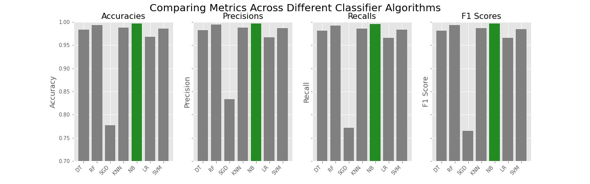

In the Flask Web App it takes in a value for each nitrogen, phospherous, potassium, ph, temperature, humidity, and rainfall and returns what crop is best for those growing conditions. To provide an example, this tool would be applicable for an experienced farmer who knows to track each of these things and has acquired a new piece of land.

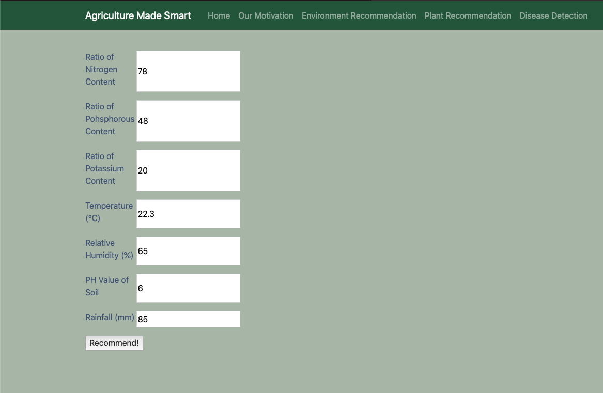
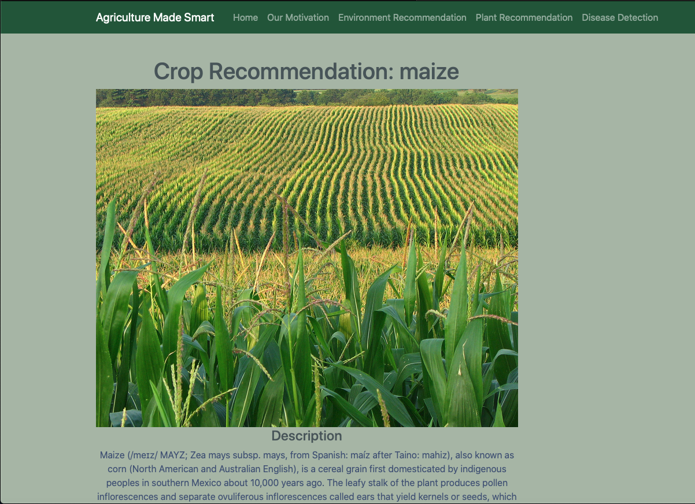

The other type of recommender in this project is a content-based recommender that calculates the cosine-similarity for each of the 22 crops to the remaining 21 using the mean values for each of the growing conditions statistics. If the user doesn't know all their growing conditions then they can simply provide the crop they currently grow and receive the top 3 most similar crops in terms of growing conditions and expand their farm according. It also provides a table of the averages for the growing conditions so that user can manually check to make sure they think the recommendations are reasonable.

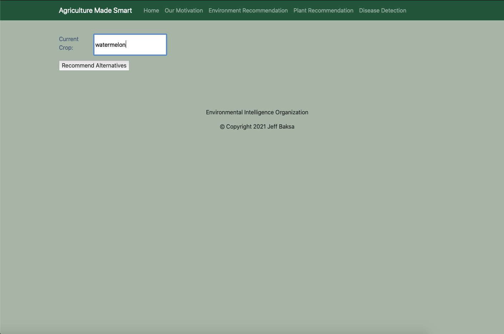
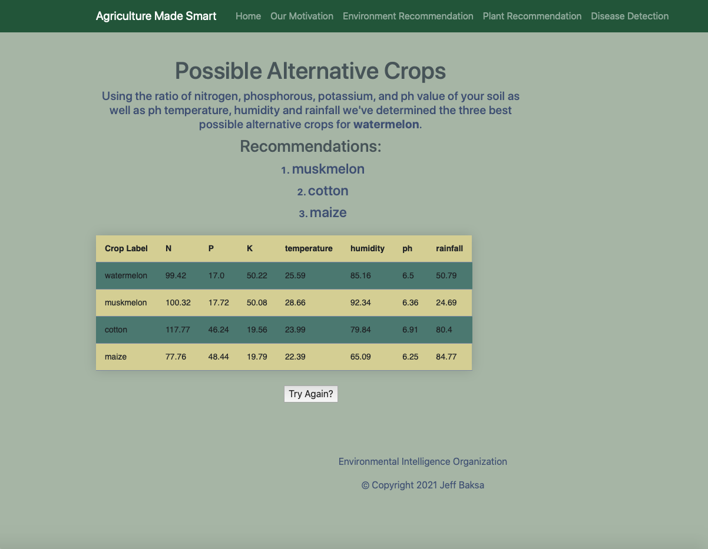

## Disease Detection
The second half of the project involves a convolutional neural network to classifier the type of plant and whether or not the plant is infected with disease (and if so, what type of disease) or not. Using transfer learning with the ResNet34 model I was able to achieve 98.7% accuracy on the test set of images. 

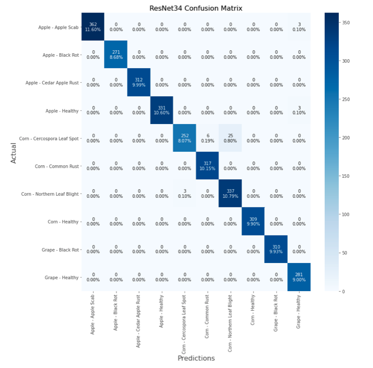

Using the Flask web app the user simply takes a picture of their potentially infected plant and hits the predict button to check.

> Ex: Infected Plant

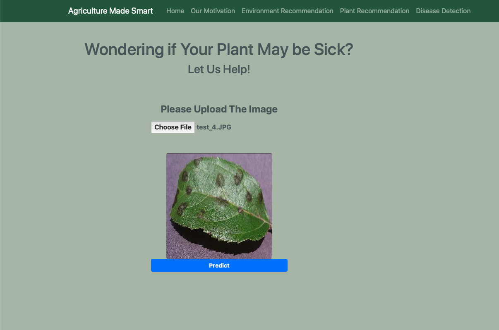
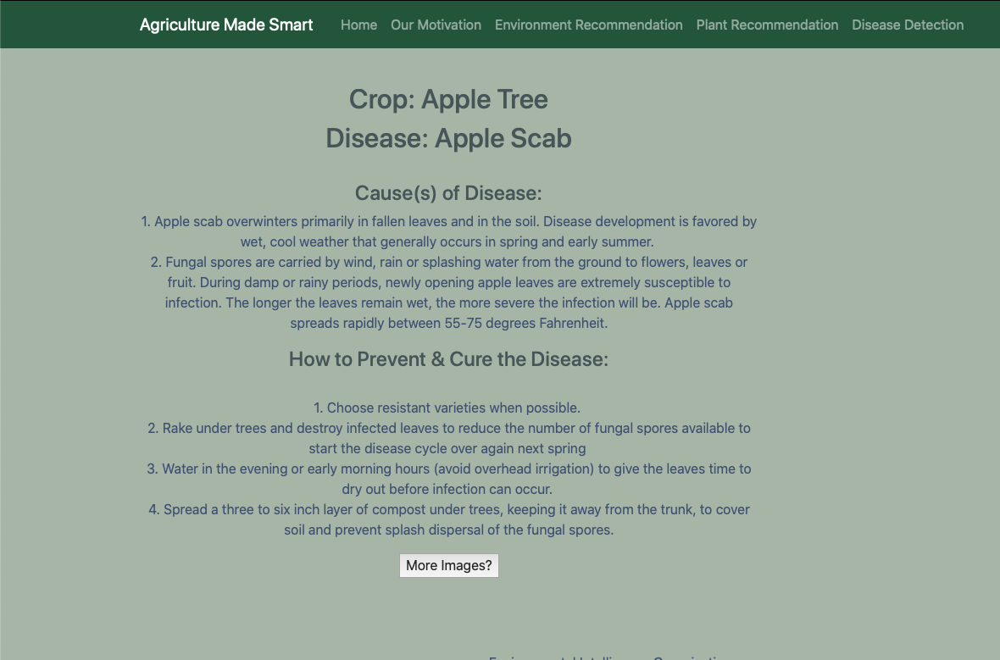

The resulting webpage will inform the farmer on possible causes of the disease and potential solutions/future prevention so that they can maximize their yeild.

> Ex: Healthy Plant

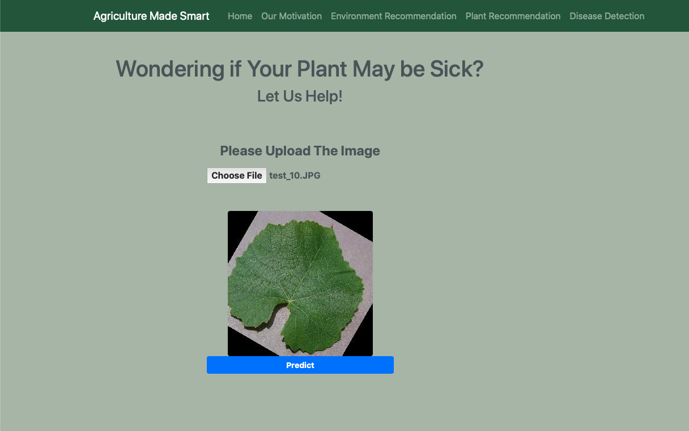
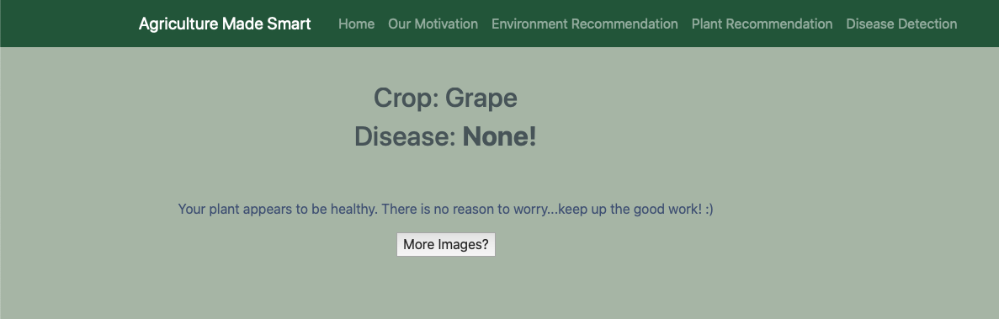

If the plant is free of the disease it will also inform the user and they can carry on with all normal operations.

## Future Steps
A list of steps I want to implement in the future... 

* Deploy Flask app on AWS or Heroku
    * Continue to improve styling / functionality on different platforms (ie: mobile, tablet, etc.)
* Expand image classification to 14 different crops and 38 different labels (disease or healthy) - 90k+ photos
    * Model working with 99.29% accuracy on validation set
* Gather growing condition data from U.S. & other additional countries
* Create interactive map (Folium) where the user can zoom in and out to see what they should plant where
* Find a way to give recommendations while taking projected effects of climate change into account
    * Avoid a farmer investing in something that isn’t sustainable in a few years time
* Add suggestions to improve soil if it’s high/low in nitrogen, phosphorus, potassium, or ph

## Technologies Used
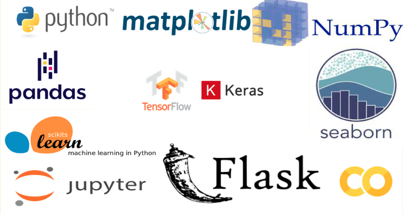